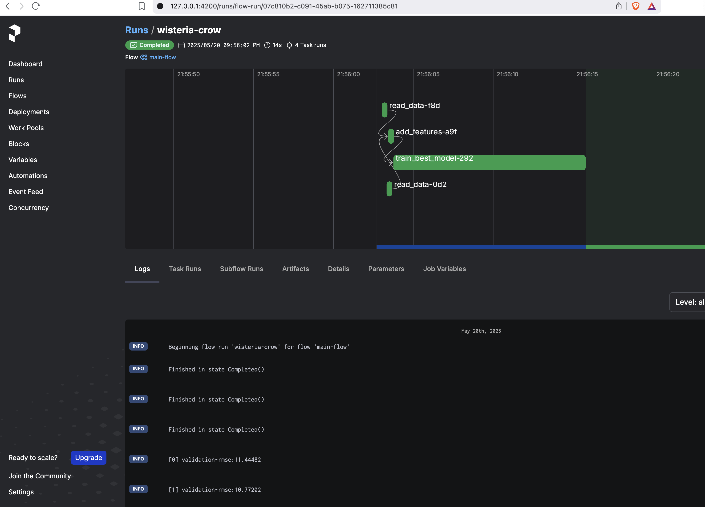
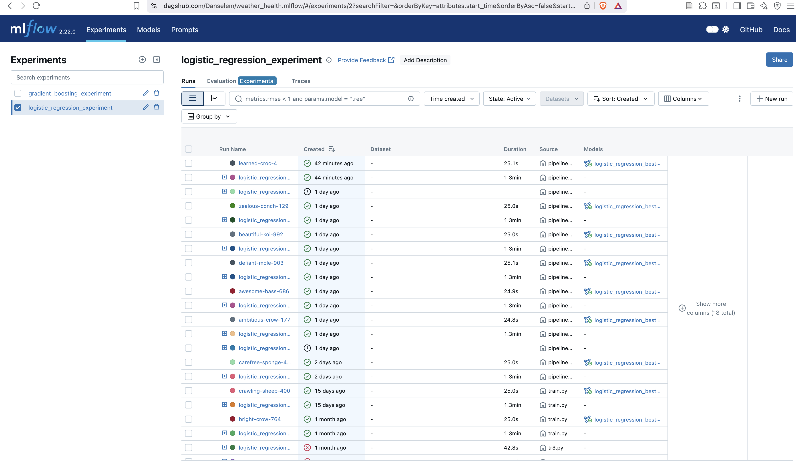
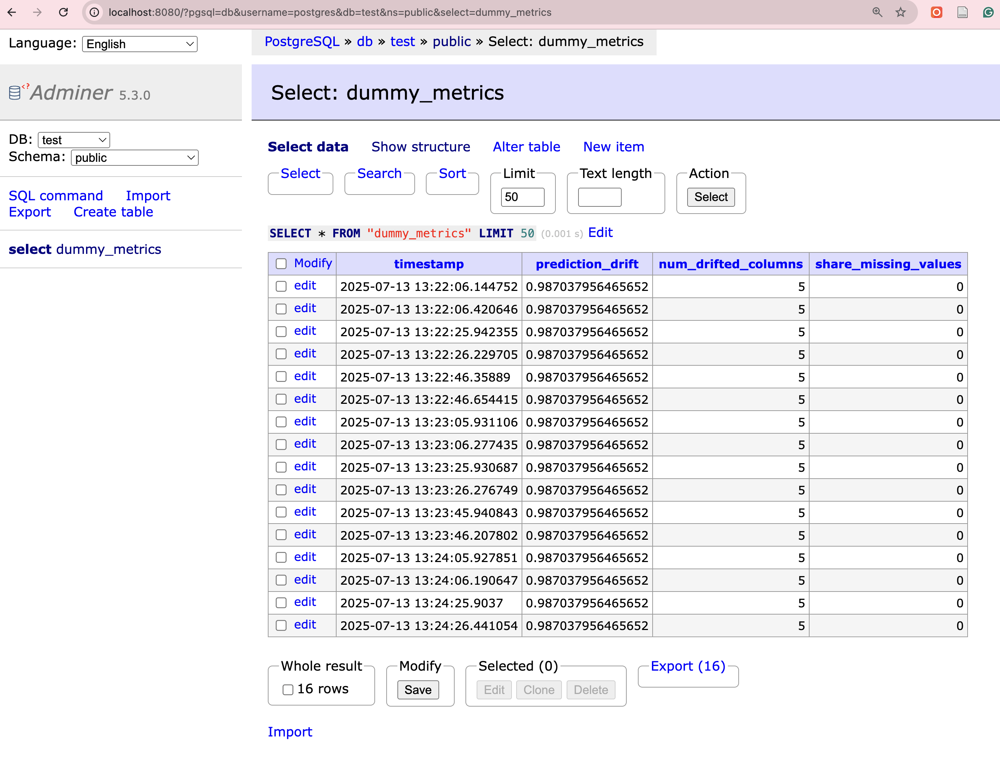
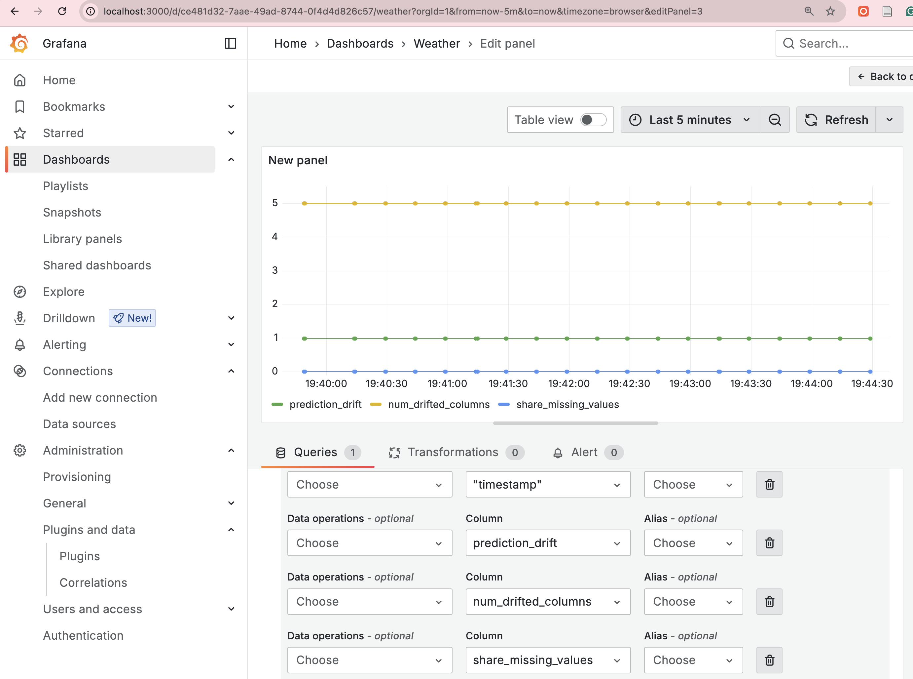

# 🌦️ Weather Disease Prediction
## 👤 Author
Title: Weather Disease Prediction: A Machine Learning Journey  
Subtitle: Leveraging Data and Modern Pipelines to Transform Public Health Prediction

Introduction:
This blog explores the development of a machine learning solution designed to predict the likelihood of weather-sensitive diseases. The project integrates comprehensive data pipelines, model interpretation, and real-time serving strategies in a robust framework, ultimately enabling proactive public health measures.

Problem & Context  
The core challenge was to build a predictive system that can classify diseases influenced by weather conditions with high accuracy and clear interpretability. The significance lies in early detection of potential outbreaks, which can empower healthcare providers and policy makers to implement timely interventions.  
• The problem originated from noticing the correlation between environmental factors and rising disease incidences, prompting an in-depth exploration into predictive modeling.  
• Users include public health officials, data scientists, and healthcare institutions.  
• Success was measured through model accuracy, precision, execution speed, and seamless integration with monitoring systems, all while maintaining minimal latency and high reliability.

Data & Modeling  
Data was collected from a rich repository of historical climate records and corresponding health data, well documented on platforms like Kaggle. The dataset includes features such as temperature, humidity, wind speed, and a range of health symptoms.  
• The data was split using robust validation techniques ensuring fair distribution, and multiple splits were experimented with to prevent overfitting.  
• Initial models ranged from basic classifiers to more advanced pipelines, with the final selection being driven by a combination of hyperparameter tuning and feature importance analysis.  
• Error analysis included comprehensive interpretability checks using metrics like feature importance, while excluding SHAP for simplicity. Calibration and threshold adjustments were also key in refining predictions.

Serving  
The final model was containerized and deployed using a combination of Prefect orchestration and Docker for local as well as cloud-based environments.  
• The API is well-defined with clear request/response schemas, and while versioning is considered, the emphasis remains on low latency and effective throughput⁠—key for real-world applications.  
• Monitoring is implemented via a combination of Evidently dashboards, admin tools, and custom logging that trigger alerts on drift or anomaly detection.  
• Automation is integrated throughout the CI/CD pipeline, yet certain stages like manual data tagging and infrastructure configuration require additional oversight.  
• Challenges, such as potential drift in rapidly changing environmental conditions, were addressed through frequent model updates and manual oversight loops to ensure stability.

Results & Impact  
Compared to the baseline, the proposed system shows a notable improvement in predictive accuracy along with enhanced interpretability for healthcare stakeholders. Empirical results indicate significant improvement in early detection rates, reducing response times and optimizing resource allocation in public health responses.  
• In production, the project is evolving towards a fully automated, scalable pipeline; currently, improvements revolve around fine-tuning further performance metrics and infrastructural resilience.  
• Each course module contributed directly—from initial data handling and model validation to the adoption of state-of-the-art deployment mechanisms like Docker and Prefect—with visible impact in daily operations.

How Each Course Module Mapped to the Project  
• Data Engineering: Concepts of feature extraction and validation shaped the initial data pipeline, ensuring that key features like temperature and humidity led to effective modeling.  
• Machine Learning and Model Tuning: Every step—from choosing the appropriate classifier to hyperparameter tuning with libraries like Hyperopt—was applied to achieve high performance.  
• Deployment and Cloud Integration: Docker and Prefect were utilized to build and manage the operational pipeline, evidencing real-time deployment and monitoring.  
• Gaps were bridged by incorporating external tools to handle aspects like Bayesian tuning and advanced observability stacks, which were not fully covered in the academic modules.

Lessons Learned  
• Underestimating the complexity of integrating continuous monitoring early on.  
• Prioritizing end-to-end automation proved invaluable despite initial challenges.  
• The practical application of Docker and Prefect directly translated from classroom concepts into real-world robustness.  
• Unexpected logistical challenges in deploying and scaling cloud resources offered vital insights into infrastructure limitations.

Advice to the Next Cohort  
• Select and scope projects that have a clear, measurable impact on a real-world problem—a well-defined problem statement makes subsequent steps more manageable.  
• Balance theoretical learning with practical execution by setting incremental milestones; this approach helps in managing time and expectations.  
• Early on, focus on establishing core metrics and monitoring to avoid overlooking crucial performance aspects.  
• Besides course materials, invest time in learning industry-standard tools (e.g., advanced observability stacks and container orchestration) to help scale projects into production-grade solutions.

Links & Credits  
• Repository: The comprehensive codebase is available on GitHub, detailing every stage from data ingestion to model deployment.  
• Demo: Live demos and further documentation can be found through linked resources in the repository.  
• Acknowledgements: Special thanks to mentors, open-source contributors, and the broader community for their invaluable insights and tools that made this project possible.

- **Daniel Egbo** – [@Danselem](https://github.com/Danselem)
  
## Project Description
This project aims to predict the likelihood of weather-sensitive diseases using machine learning. By analyzing historical climate and health records, it provides early warnings for disease outbreaks, empowering public health systems to respond proactively.

## 🧩 Problem Statement

Weather patterns influence the prevalence and spread of many diseases such as asthma, flu, and other respiratory conditions. The challenge is to build a robust prediction system that can:

- Accurately classify disease categories based on environmental conditions.
- Offer explainability of the predictions for healthcare stakeholders.
- Generalize well to unseen data from other regions or time periods.

## 🗃️ Dataset Overview

The dataset contains features related to weather and environmental measurements along with disease labels. Typical columns include: Age, Gender, Temperature (C), Humidity, Wind Speed (km/h), nausea, joint_pain, abdominal_pain, high_fever, chills,...,back_pain, knee_ache.

**Dataset Source:** Additional info about the data can be found on [Kaggle](https://www.kaggle.com/datasets/orvile/weather-related-disease-prediction-dataset/data).


## 🧠 Features

- End-to-end scikit-learn pipeline
- Hyperparameter optimization using Hyperopt
- Multiclass classification support
- Evaluation metrics and plots
- Feature importance for model interpretability

---

## 📊 Evaluation Outputs

| Metric     | Description                              |
|------------|------------------------------------------|
| Accuracy   | Overall correct predictions              |
| Precision  | Correctness among positive predictions   |
| Recall     | Coverage of actual positives             |
| F1-Score   | Harmonic mean of precision & recall      |


---

## ✅ Requirements

- Python 3.10+
- pandas
- scikit-learn
- matplotlib
- seaborn
- numpy
- pickle
- hyperopt 
- prefect
- evidently

## 🚀 Getting Started

### 1. Clone the repository

```bash
git clone https://github.com/Danselem/weather-health.git
cd weather-health
```

The project makes use of `Makefile` and [Astral uv](https://docs.astral.sh/uv/). Click the Astral link to see the details of the package and how to install it.

### 2. Create and activate a virtual environment
To create and activate an environment:

```bash
make init
```

### 3. Install dependencies

```bash
make install
```

### 4. Set up MLflow server

There are two options to set up MLflow

1. **Use AWS EC2 and S3**
Ensure terraform is installed on your PC and you have AWS credentials set up on your PC with `aws configure`. Next, `cd infra` then follow the instructions in [infra](infra/infra.md) for a complete set up of AWS resources including `EC2`, `RDS`, `S3`, `Kinesis`, `Lambda`, etc.

2. **Use DagsHub**
Sign up at [Dagshub](https://dagshub.com/) and obtain an API key and create a project repo. After that, run the command to create a `.env` file:

```bash
make env
```
Next, fill the `.env` file with the right information.


### 5. Start the orchestrator.
This project uses `Prefect` for running the ML pipeline. To start the prefect server, run the command:
```bash
make prefect
```
This will start a prefect server running at <https://127.0.0.1/4200>.

### 6 Run the ML Pipeline
To run the pipeline,
```bash
make pipeline
```
This will proceed to load the data, clean it, transform it and start the hyper-parameter tuning.  See image below for the prefect modeling pipeline

.

It will also log the ML experiments in Dagshub. For example, see below.
.

All experiments ran for this project can be accessed in [here](https://dagshub.com/Danselem/weather_health/experiments).

### 7. Fetch and serve the best model
```bash
fetch-best-model
```
The above command will fetch the best model from the Dagshub ML server and save it in the [models](models) repo. With this, we are ready to serve the model.

Generate sample data for testing the serve service.
```bash
make sample
```
Test the local deployment
```bash
make serve_local
```

**Test for `[docker](/Dockerfile)` deployment**

Build the docker
```bash
make build
```
Start the docker container
```bash
make run
```
Then test the serve script:
```bash
make serve
```

### 8. Monitoring
A simulated inference was performed in this project for testing observability with `Evidently`. See the [observability](/monitoring/) directory.

Start the container

```bash
start-monitoring
```
This will start a docker compose with `postgres`, `adminer` and `grafana`. 

Adminer can be accessed at <https://127.0.0.1/8080>. Grafana can be accessed at <https://127.0.0.1/3000>.

Simulate the inference with the command:

```bash
make observe
```

For example, see 






---

## 🧪 Testing

To test your setup or add unit tests:

```bash
pytest tests/
```

---

## 📌 Notes

- Label encoding is required for correct ROC/metric computation.
- Only models with `.feature_importances_` are supported for feature explanation.
- SHAP and PDP (partial dependence plots) are excluded for simplicity and clarity.

---

## 📜 License

This project is licensed under the MIT [License](/LICENSE).

---

## 🙋🏽‍♀️ Contact

Created by [Daniel Egbo](mailto:danoegbo@example.com). Feel free to reach out with questions, issues, or suggestions.
